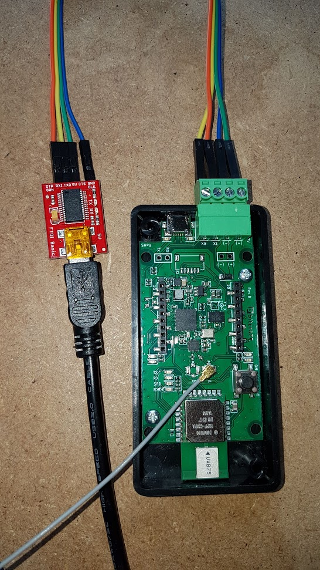

# roadrunner_mavlink

MAVLink**v1** layer (lower header size) for the roadrunner to act as a sensor on UART2 (green UART port).

To (re)generate the C/Python MAVLink files of roadrunner.xml, run:

```bash
./generate.sh
```

## Connection

Connect the UART to your best UART<->USB (or UART) capable device that has `1000000` baudrate available.



## ROS Usage

Flash the firmware using the following custom firmware using this implmenetation available at: [umdlife/crazyflie-firmware#u2_feature_custom_kalman](https://github.com/umdlife/crazyflie-firmware/tree/u2_feature_custom_kalman)

Differences to the main branch:
* Uses the **complementary filter** instead of the kalman filter to have a more (much more) stable IMU (see: [bitcraze/crazyflie-firmware/issues/426](https://github.com/bitcraze/crazyflie-firmware/issues/426))
* Disables the **controller** (using NO_CONTROLLER)
* Enables the UART2 at 1000000 baudrate by default
* Sends the TDOA measurement over UART2 (TDOA_MEASUREMENT message), by default max frequency (max 400Hz, typical 200Hz)
* Sends the IMU raw measurements over UART2 (GYRO_ACC message), by default 100Hz
* Sends the IMU quaternion computed over UART2 (QUATERNION message), by default 20Hz

```
mkdir -p ~/Tools
cd ~/Tools
git clone https://github.com/umdlife/crazyflie-firmware --recursive -b u2_feature_custom_kalman
cd crazyflie-firmware
make PLATFORM=tag clean
make PLATFORM=tag -j
# Put the board in DFU flash mode before this action, by holding the ON-OFF-BOOT button for 5 seconds while booting and once it starts blinking fast, press the button once more. 
make PLATFORM=tag flash_dfu
# the PLATFORM=tag option is defaulted to your value after one call.
```

You can then reboot the roadrunner and use the roadrunner_receiver.py.

```
mkdir -p ~/Tools
cd ~/Tools
git clone https://github.com/AlexisTM/MultilaterationTDOA
cd MultilaterationTDOA
sudo python2 setup.py install

cd ~/Tools
git clone https://github.com/umdlife/roadrunner_mavlink
cd roadrunner_mavlink/scripts
python2 roadrunner_receiver.py
```
